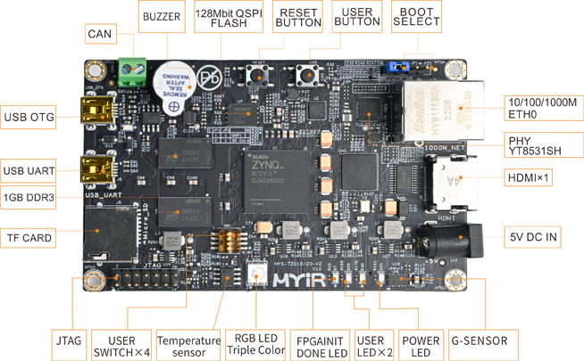
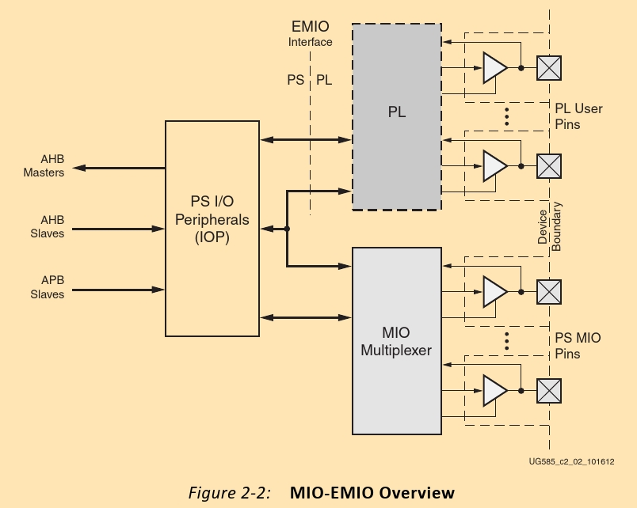
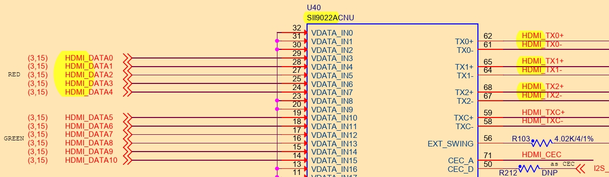
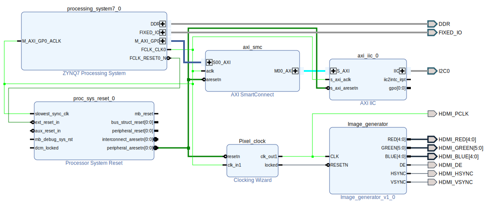
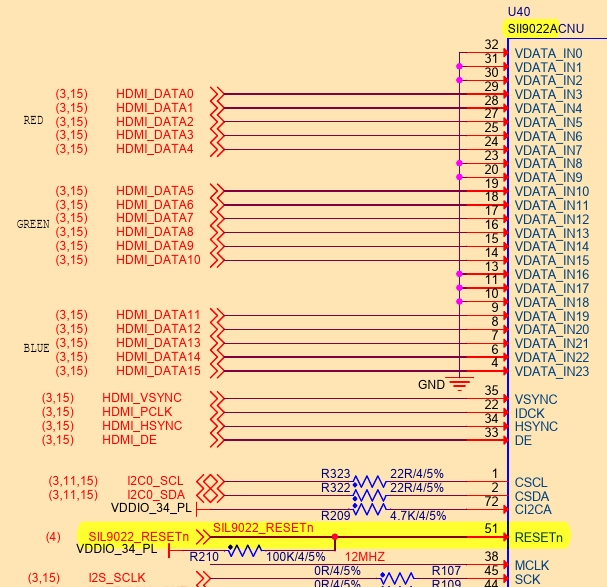
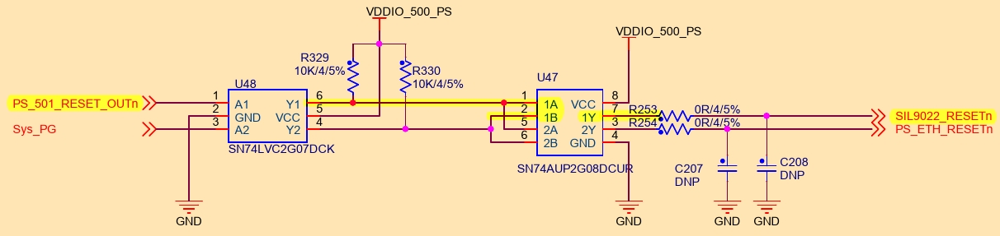
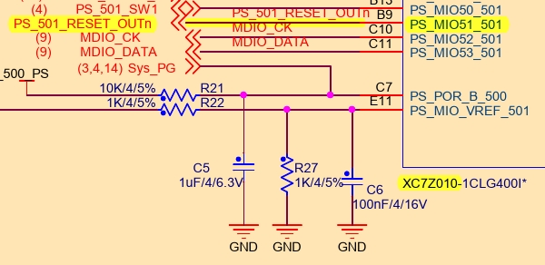
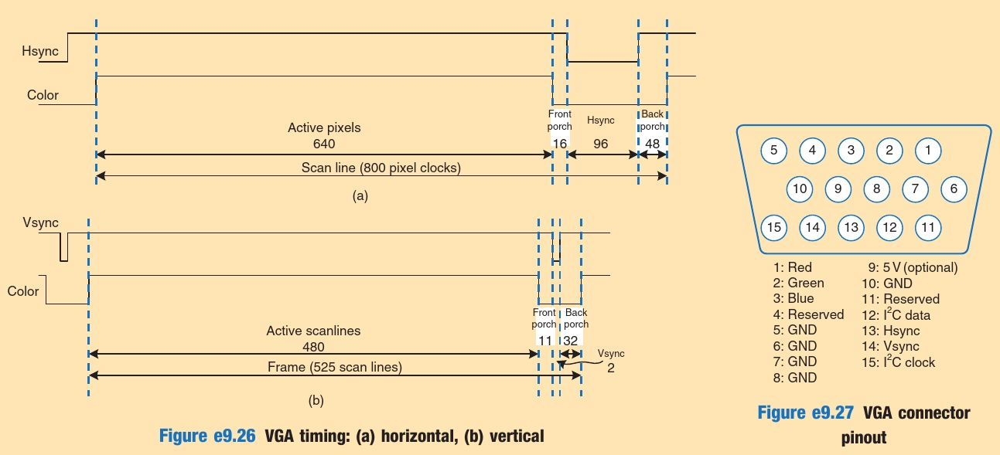
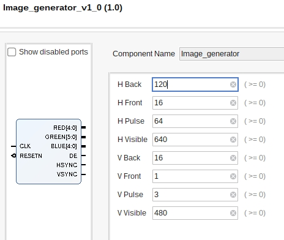

# Zynq.HDMI.Z-turn.Sil9022A

Starting up HDMI on a Z-turn V2 board

---

# Table of Contents
- ## [Introduction](#Introduction)

# Introduction

The [z-turn][z-turn] board, is a [Zynq][Zynq] [PCB][PCB], featuring multiple peripherals:



Those, are connected either to the [PL][PL] or the [PS][PS] part of a Zynq.

In order to find, where the HDMI is connected to, we can reference the [schematics](doc/zturnv2Schematic.pdf). According to these, they are connected to the [PL][PL] part (since the [PS][PS] pins are numbered [MIO_#][MIO]).




Looking further down [the schematics], we see that the signals pass through an "HDMI transmitter".



As a result, we must power up the transmitter

# Design



A relatively easy method, is to let the PS handle the powering up of the transmitter. The PL will handle the visual part.  
(Another method, would be through `.coe` files, eliminating the need for the PS).

This design, features an **AXI I2C interface** (TODO use native) to talk to the common i2c-0 bus (at least three devices use it). A **clocking wizard** is needed in order to provide a different clock for the pixels. Note: Although Sil9022A may handle up to 165MHz, it features a multiplier (and a divider) if the need arises.

(A constraint file is provided in the [constraint files](code/constraint files) folder).

## PS - Activating Sil9022A (i.e. the HDMI transmitter)

(TODO move to native/ PS I2C)

The minimal configuration needed is the following:

1. Raise the `RESETn` signal [to power up Sil9022A]
2. Write `0x00` to register `0xC7`, in order to enable (?) TPI (Transmitter Programming Interface)
3. Wait for ID to stabilize (at 0x1B-1D, 30).
4. Enable (?) source termination
5. Disable TMDS output (at `0x1A`)
6. Switch from D2 to D0 state (at `0x1E`)
7. Enable TMDS output (at `0x1A`)

<!-- A comment to break numbering -->

* The RESETn signal will be handled using the ***Gpio-PS standalone driver***
* The i2c will be handled using the ***AXI-I2C standalone driver***

### GPIO

#### Schematics

There are 2 drivers for GPIO, one for AXI and one for native/ PS.

Searching through the schematics for the RESETn pin, we can see it's connected to `MIO51`. The signal passes first through a buffer and then through an AND gate.





#### Code


### I2C

## PL - Creating a signal generator

HDMI does not care about Hsync/Vsync **polarity**, so let's keep them **positive** (to reduce Sil9022A configuration).

A sample `vhdl` file is provided inside the [code](code) folder, named [Image_generator.vhd](/home/ladon/contmp/Zynq.HDMI.Z-turn.Sil9022A/code/Image_generator.vhd):

```vhdl
library ieee;
use ieee.std_logic_1164.all;
use ieee.numeric_std.all;
use ieee.math_real.all; -- Needed for the `ceil()` function

-- ===============================================
--  For synchronisation, pixels are ordered as
--    Visible, Front, H/V Pulse, Back, [-repeat-]
-- ===============================================
entity Image_generator is
    Generic (
        -- ===============================
        --  Horizontal timing (in pixels)
        -- ===============================
        H_VISIBLE   : natural := 640;
        H_FRONT     : natural := 16;
        H_PULSE     : natural := 64;
        H_BACK      : natural := 120;

        -- =============================
        --  Vertical timing (in pixels)
        -- =============================
        V_VISIBLE   : natural := 480;
        V_FRONT     : natural := 1;
        V_PULSE     : natural := 3;
        V_BACK      : natural := 16);

    Port (
        CLK     : in  std_logic;
        RESETN  : in  std_logic;

        -- ========
        --  Colors
        -- ========
        RED     : out std_logic_vector(4 downto 0);
        GREEN   : out std_logic_vector(5 downto 0);
        BLUE    : out std_logic_vector(4 downto 0);

        -- =======================================
        --  Data Enable (signals visible pixels)
        --  Unrelated to VGA. Required by HDMI.
        --  The HDMI transmitter can generate it.
        -- =======================================
        DE      : out std_logic;

        -- =======================================================
        --  Synchronization signals (polarization is unnecessary)
        -- =======================================================
        HSYNC   : out std_logic;
        VSYNC   : out std_logic);
end Image_generator;

architecture arch of Image_generator is
    -- ====================================
    --  Calculate required bits for number
    -- ====================================
    function bit_width (num: natural) return natural is
    begin
        if num = 0 then
            return 1;
        else
            return integer(ceil(log2(real(num + 1))));
        end if;
    end function bit_width;

    -- =========
    --  Aliases
    -- =========
    constant H_TOTAL        : natural := H_VISIBLE + H_FRONT + H_PULSE + H_BACK;
    constant V_TOTAL        : natural := V_VISIBLE + V_FRONT + V_PULSE + V_BACK;
    -- ==
    constant HSYNC_START    : natural := H_VISIBLE + H_FRONT;
    constant HSYNC_STOP     : natural := H_VISIBLE + H_FRONT + H_PULSE - 1;
    -- ==
    constant VSYNC_START    : natural := V_VISIBLE + V_FRONT;
    constant VSYNC_STOP     : natural := V_VISIBLE + V_FRONT + V_PULSE - 1;

    -- ===========
    --  Variables
    -- ===========
    signal h_pos    : natural range 0 to 2**bit_width(H_TOTAL) - 1;
    signal v_pos    : natural range 0 to 2**bit_width(V_TOTAL) - 1;
begin
    HSYNC   <= '1' when
        h_pos >= HSYNC_START and
        h_pos <= HSYNC_STOP else '0';
    VSYNC   <= '1' when
        v_pos >= VSYNC_START and
        v_pos <= VSYNC_STOP else '0';

    -- ===============================================
    --  (Pixel ordering: Visible, Front, Pulse, Back)
    -- ===============================================
    DE      <= '1' when h_pos < H_VISIBLE and v_pos < V_VISIBLE else '0';

    -- ========
    --  Output
    -- ========
    RED     <= std_logic_vector(to_unsigned(16#19#, RED'length));
    GREEN   <= std_logic_vector(to_unsigned(16#19#, GREEN'length));
    BLUE    <= std_logic_vector(to_unsigned(16#70#, BLUE'length));

    -- ================
    --  Advance line
    --  Advance column
    -- ================
    process (CLK, RESETN) is
    begin
        if rising_edge(CLK) then
            -- =======
            --  Reset
            -- =======
            if RESETN = '0' then
                h_pos   <= 0;
                v_pos   <= 0;
            else
                if h_pos >= H_TOTAL - 1 then
                    h_pos   <= 0;
                    -- ===============
                    --  Restart frame
                    -- ===============
                    if v_pos >= V_TOTAL - 1 then
                        v_pos   <= 0;
                    -- ======================
                    --  Advance to next line
                    -- ======================
                    else
                        v_pos   <= v_pos + 1;
                    end if;
                -- ========================
                --  Advance to next column
                -- ========================
                else
                    h_pos   <= h_pos + 1;
                end if;
            end if;
        end if;
    end process;
end arch;
```



## Monitor capabilities

One way to read the monitor's capabilities, is through its [edid][EDID] file.
> One way to access it under linux, is via the `/sys` interface using `edid-decode`:  
> `$ edid-decode /sys/devices/pci0000\:00/0000\:00\:02.0/drm/card0/card0-HDMI-A-1/edid`  
> ^The proper path can be searched: `$ find /sys -name edid`


Example [edid][EDID] files are included in the [edids](doc/edids) folder.

```bash
edid-decode (hex):

00 ff ff ff ff ff ff 00 4c 2d d0 01 31 32 52 42
04 10 01 03 80 2b 20 78 2a ee 95 a3 54 4c 99 26
0f 50 54 bf ef 80 a9 40 81 80 81 40 71 4f 01 01
01 01 01 01 01 01 48 3f 40 30 62 b0 32 40 40 c0
13 00 b0 44 11 00 00 1e 00 00 00 fd 00 38 4b 1e
51 11 00 0a 20 20 20 20 20 20 00 00 00 fc 00 53
79 6e 63 4d 61 73 74 65 72 0a 20 20 00 00 00 ff
00 48 53 58 41 31 30 33 31 35 32 0a 20 20 00 f4

----------------

Block 0, Base EDID:
  EDID Structure Version & Revision: 1.3
  Vendor & Product Identification:
    Manufacturer: SAM
    Model: 464
    Serial Number: 1112683057
    Made in: week 4 of 2006
  Basic Display Parameters & Features:
    Digital display
    Maximum image size: 43 cm x 32 cm
    Gamma: 2.20
    DPMS levels: Off
    RGB color display
    First detailed timing is the preferred timing
  Color Characteristics:
    Red  : 0.6396, 0.3300
    Green: 0.2998, 0.5996
    Blue : 0.1503, 0.0595
    White: 0.3134, 0.3291
  Established Timings I & II:
    IBM     :   720x400    70.081663 Hz   9:5     31.467 kHz     28.320000 MHz
    DMT 0x04:   640x480    59.940476 Hz   4:3     31.469 kHz     25.175000 MHz
    Apple   :   640x480    66.666667 Hz   4:3     35.000 kHz     30.240000 MHz
    DMT 0x05:   640x480    72.808802 Hz   4:3     37.861 kHz     31.500000 MHz
    DMT 0x06:   640x480    75.000000 Hz   4:3     37.500 kHz     31.500000 MHz
    DMT 0x08:   800x600    56.250000 Hz   4:3     35.156 kHz     36.000000 MHz
    DMT 0x09:   800x600    60.316541 Hz   4:3     37.879 kHz     40.000000 MHz
    DMT 0x0a:   800x600    72.187572 Hz   4:3     48.077 kHz     50.000000 MHz
    DMT 0x0b:   800x600    75.000000 Hz   4:3     46.875 kHz     49.500000 MHz
    Apple   :   832x624    74.551266 Hz   4:3     49.726 kHz     57.284000 MHz
    DMT 0x10:  1024x768    60.003840 Hz   4:3     48.363 kHz     65.000000 MHz
    DMT 0x11:  1024x768    70.069359 Hz   4:3     56.476 kHz     75.000000 MHz
    DMT 0x12:  1024x768    75.028582 Hz   4:3     60.023 kHz     78.750000 MHz
    DMT 0x24:  1280x1024   75.024675 Hz   5:4     79.976 kHz    135.000000 MHz
    Apple   :  1152x870    75.061550 Hz 192:145   68.681 kHz    100.000000 MHz
  Standard Timings:
    DMT 0x33:  1600x1200   60.000000 Hz   4:3     75.000 kHz    162.000000 MHz
    DMT 0x23:  1280x1024   60.019740 Hz   5:4     63.981 kHz    108.000000 MHz
    DMT 0x20:  1280x960    60.000000 Hz   4:3     60.000 kHz    108.000000 MHz
    DMT 0x15:  1152x864    75.000000 Hz   4:3     67.500 kHz    108.000000 MHz
  Detailed Timing Descriptors:
    DTD 1:  1600x1200   60.000000 Hz   4:3     75.000 kHz    162.000000 MHz (432 mm x 324 mm)
                 Hfront   64 Hsync 192 Hback  304 Hpol P
                 Vfront    1 Vsync   3 Vback   46 Vpol P
    Display Range Limits:
      Monitor ranges (GTF): 56-75 Hz V, 30-81 kHz H, max dotclock 170 MHz
    Display Product Name: 'SyncMaster'
    Display Product Serial Number: 'HSXA103152'
Checksum: 0xf4
```

After identifying a proper mode, say.. **DMT 0x06**, we can ask [tinyvga.com](http://www.tinyvga.com/vga-timing/640x480@75Hz) for the proper timings 😇. (TODO failed with LG Flatron L2000C).



# Referencies
* [HDMI Made Easy: HDMI-to-VGA and VGA-to-HDMI Converters](https://www.analog.com/en/resources/analog-dialogue/articles/hdmi-made-easy.html)
* [Z-Turn board HDMI out](https://github.com/hauerdie/z-turn-board-hdmi-out)
* [various HDMI info](https://www.eaton.com/us/en-us/products/backup-power-ups-surge-it-power-distribution/backup-power-ups-it-power-distribution-resources/cpdi-vertical-marketing/hdmi-explained.html)
* [Digital Design and Computer Architecture, ARM Edition](https://shop.elsevier.com/books/digital-design-and-computer-architecture-arm-edition/harris/978-0-12-800056-4)
* [VESA timings](http://www.tinyvga.com/vga-timing)

<!-- References/ invisible parts -->

[z-turn]: https://www.myirtech.com/list.asp?id=708
[Zynq]: https://www.amd.com/en/products/adaptive-socs-and-fpgas/soc/zynq-7000.html
[PCB]: https://en.wikipedia.org/wiki/Printed_circuit_board
[PL]: ## "Programmable Logic"
[PS]: ## "Processing System"
[MIO]: ## "Multiplexed I/O"
[EDID]: https://en.wikipedia.org/wiki/Extended_Display_Identification_Data